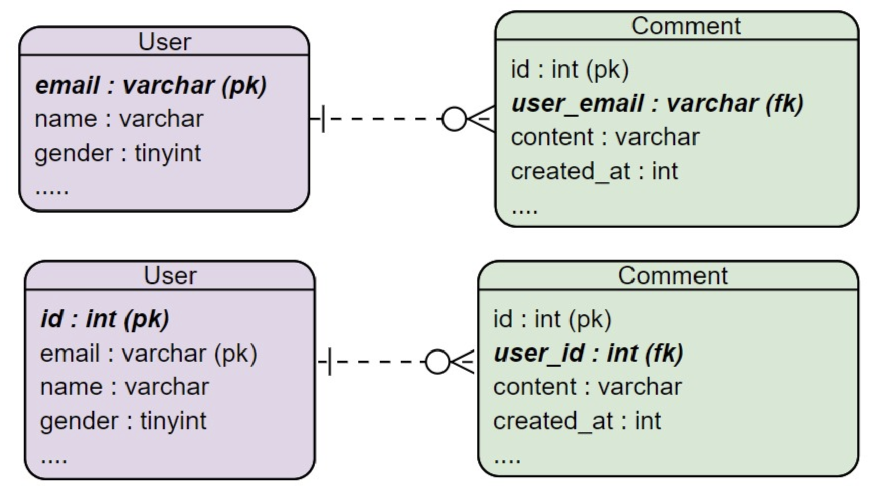

> 2021년 7월 15일 - 테이블 설계와 반정규화

## 테이블 설계와 반정규화

### 테이블 설계 시 주의사항

- 시간 관련 컬럼은 unix_time 같은 시간 type 사용하기

  - Varchar를 사용할 경우 DB 쿼리문에서 최근 일주일 검색 등 시간 연산이 어려움

  - 참고 자료 : [MySQL 시간 관련 Data Type 차이](MySQL-시간-관련-Data-Type-차이.md)

    ```
    varchar - 2021071521 (X)
    unix_time - 1594034034 (O)
    ```

- PK, FK 등 Key는 Interger 같은 정수 type 사용하기

  - Varchar 사용 시 white space (눈에 보이지 않는 문자) 가 포함된 경우 디버깅하기 어려움
  - 모든 테이블에 id, num 같은 컬럼을 일관성 있게 Key로 사용하면 좋음
    - id, num 등의 PK 필드가 있다고 생각하자!

  

### 반정규화

- DB 성능 향상으로 인한 속도 증가로 서버 성능에 이득을 얻기 위해 사용

- 반정규화 하면 미래에 데이터 오류 발생 가능성이 큼
  - 이때, 서버 성능에 대한 이득보다 오류의 비용이 더 클 수 있음
- 따라서 가급적 반정규화 하지 말고, 속도가 느려지면 하드웨어 증설할 것
  - 하드웨어 증설이 오류 발생 후 대응하는 비용보다 더 저렴한 경우가 많음.

```
반정규화 👉 무결성이 깨짐 👉 데이터 구조에 오류를 허용 👉 기술 부채
```