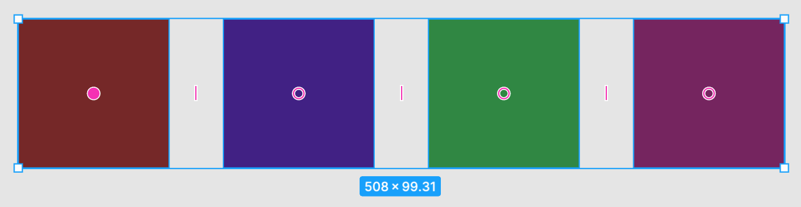
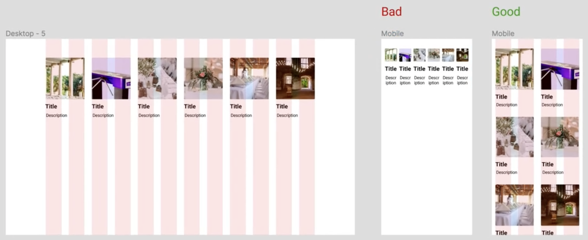
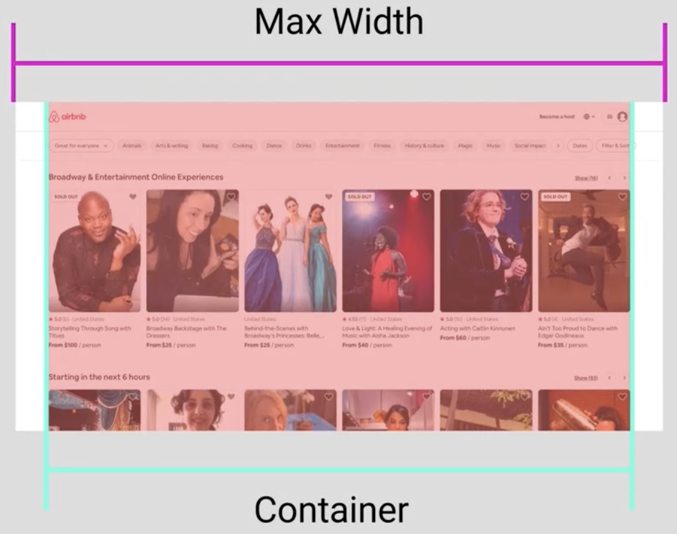
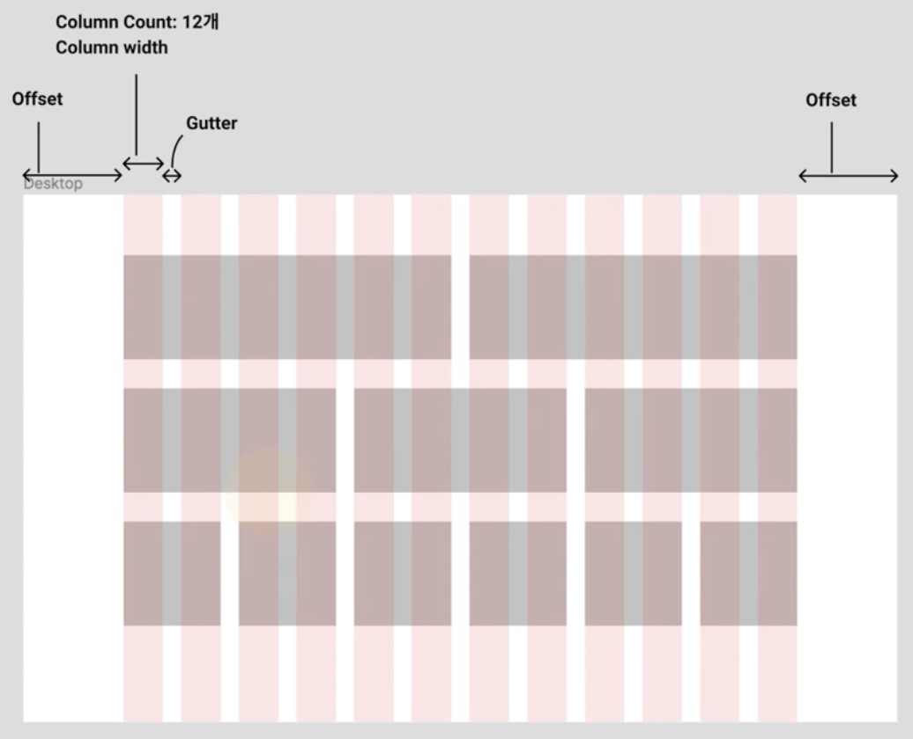
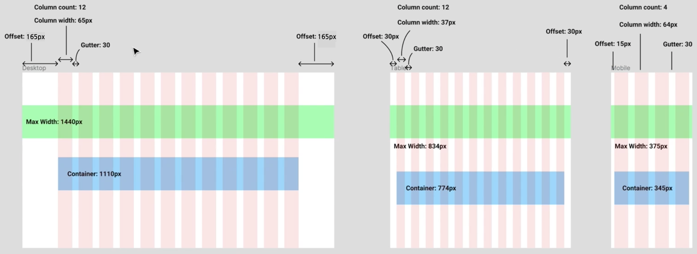

> 2021년 7월 24일 - Figma 기초 기능 및 활용법

## Figma 기초 기능

### 사이즈 변경

- 자유 변경
  - 코너 잡고 드래그
- 비율 고정 사이즈 변경
  - Shift 누른 상태에서 코너 잡고 드래그
- 비율 고정 & 가운데 중심으로 사이즈 변경
  - Shift + Alt 누른 상태에서 코너 잡고 드래그
- 수치 값 직접 설정
  - 우측에서 W, H 값 입력

### 회전

- 자유 회전
  - 코너 바깥 쪽을 잡고 회전
- 15도 단위 회전
  - Shift 누른 상태에서 코너 바깥 쪽을 잡고 회전
- 수치 값 직접 설정
  - 우측에서 각도 값 입력

### 반전

- 좌우 반전
  - 마우스 우측 클릭 후 Flip Horizontal
- 상하 반전
  - 마우스 우측 클릭 후 Flip Vertical

### 이동

- 자유 이동
  - 마우스로 선택 후 이동
- 1px 단위로 이동
  - 키보드 상하좌우 키
- 10px 단위로 이동
  - Shift 누른 상태에서 키보드 상하좌우 키

### 간격 확인 🍯

- 하나의 오브젝트 선택 후 Alt를 누른 상태에서 다른 오브젝트에 커서를 올리기

### 정렬

- 선택한 기준에 맞게 Object들이 정렬됨

- 정렬하고 싶은 Object들 선택 후 우측에서 버튼 클릭
  - Align left
  - Align horizontal centers
  - Align right
  - Align top
  - Align vertical centers
  - Align bottom

### 분배

- 선택한 기준에 맞게 Object들의 간격이 조정됨

- 간격을 맞추고 싶은 Object들 선택 후 우측에서 버튼 클릭
  - Distribute vertical spacing
  - Distribute horizontal spacing

### Tidy up

- 선택한 기준에 맞게 Object들이 정렬 및 간격 조정됨

- 간격을 맞추고 싶은 Object들 선택 후 우측에서 버튼 클릭

### Smart Selection

- Object와 다른 Object의 순서를 바꾸고 싶을 때 사용
- 순서를 바꾸고 싶은 Object들을 선택 후 위치를 바꿀 Object를 옮길 곳으로 드래그

### 텍스트

- Auto Width
  - 텍스트를 한 줄로 풀어서 사이즈를 맞추어 줌
- Auto Height
  - 여러 줄이 있을 때 사이즈를 줄에 맞추어 줌
- 텍스트 특성, 크기, 행간, 자간, 단락 간격, 정렬 등 우측에서 조정 가능
- Type details
  - 그외 자세한 설정 가능

### 색의 응용

- Solid
  - 한 가지 색 적용
- Linear
  - 여러 색으로 그라데이션
  - 각 위치의 색과 그라데이션 방향 지정 가능
- Color Picker
  - 색상 선택 창에서 버튼 클릭 후 원하는 색 선택
  - 단축키 : i 누르고 원하는 색 선택

### 이미지

- 화면에 이미지 불러오는 방법
  - Shape Tools에서 Place image...
  - 폴더에서 원하는 이미지를 드래그
- 비율을 유지한 상태에서 사이즈 조절하는 것을 추천
- 피그마 내에서도 간단한 사진 보정 가능
- Crop 기능 이용해서 원하는 부분만 자를 수 있음
- 사이즈 조정해도 이미지 찌그러지지 않는 것이 장점
  - 사이즈에 맞춰 이미지 일부 영역만 보여줌
  - 이때 원하는 영역을 보여주려면 Crop으로 설정 변경 후 선택

### 마스크

- 어떤 도형에 이미지를 입히는 것
- 도형과 이미지를 함께 선택한 후 Use as mask
  - 도형은 레이어 상에서 이미지보다 뒤에 위치해야 함
- 프로필 사진, 아이콘 등에 주로 사용

### 이펙트

- Drop Shadow
  - 위치, Blur, Spread, 투명도 등 원하는대로 값 설정 가능

- Background Blur
  - 이미지와 동일한 사이즈의 도형 만들고 이펙트 적용
  - Blur와 투명도 값을 조정해서 이미지에 흐림 효과 적용

## 플러그인과 템플릿

### 플러그인

- Community 채널에서 Plugins 클릭
- 써드파티에서 제공하는 여러 가지 플러그인 중 필요한 것 사용
  - Unsplash
  - Material Design Icons
  - ...
- Install 버튼만 누르면 설치 됨
- 마우스 우측 클릭 후 Plugins - 설치된 플러그인 선택해서 사용
- 사용성을 높여주기 때문에 여러 가지 사용해보는 것 추천

### 템플릿

- 사람들이 공유한 오픈소스를 다운로드 없이 사용 가능
- 원하는 템플릿 선택 하고 Duplicate 클릭하면 파일이 열림
  - 필요한 Layer와 Asset 가져다가 사용
- Google에서 키워드 + figma template로 검색해도 자료 찾을 수 있음

## Figma의 그리드

### 사용하는 이유

1. 정돈된 디자인

   - Object를 일정한 크기, 간격으로 둘 수 있게하는 가이드 역할

2. Responsive 디자인

   - 하나의 디자인 틀을 여러 디바이스에서 재활용 가능

   - 디자인 요소들을 디바이스별로 재배치 할 때 사용자에게 적합하도록 도와줌

   - 사용자 입장에서 익숙한 사용자 경험을 할 수 있음

   - ex) 웹 화면을 모바일 화면으로 옮길 때 그리드 활용

     

3. 개발자와의 원할한 커뮤니케이션

   - 화면을 디자인하고 디자인 요소를 어떻게 배치할 것인지 그리드로 정의
   - 개발자가 디자인의 의도를 더 잘 이해할 수 있도록 도와줌

### 핵심 용어

- Max Width
  - 보여지는 브라우저 화면의 가로 전체 길이
- Container
  - 화면 상의 콘텐츠가 담기는 영역
  - 컨테이너 사이즈, 그리드 구성에 대한 정해진 답은 없다!
  - 디자인하는 서비스에 맞춰서 정의하면 됨

- Gutter
  - 열과 열 사이 간격의 길이
- Column Width
  - 화면 상에 배치된 열의 가로 길이
- Column Count
  - 화면 상에 배치된 열의 개수
- Offset
  - 컨테이너 바깥에 해당하는 영역

ex) 디바이스별 그리드 배치에 대한 예시

### 그리드 만들기

- 오른쪽에서 Layout Grid 추가하고 원하는 값 설정

- 빨간색 말고도 원하는 색으로 설정 가능
- 그리드 보였다 안 보였다 하는 단축키 : Control + G
- Object 배치 할 때는 정보 계층를 고려할 것
