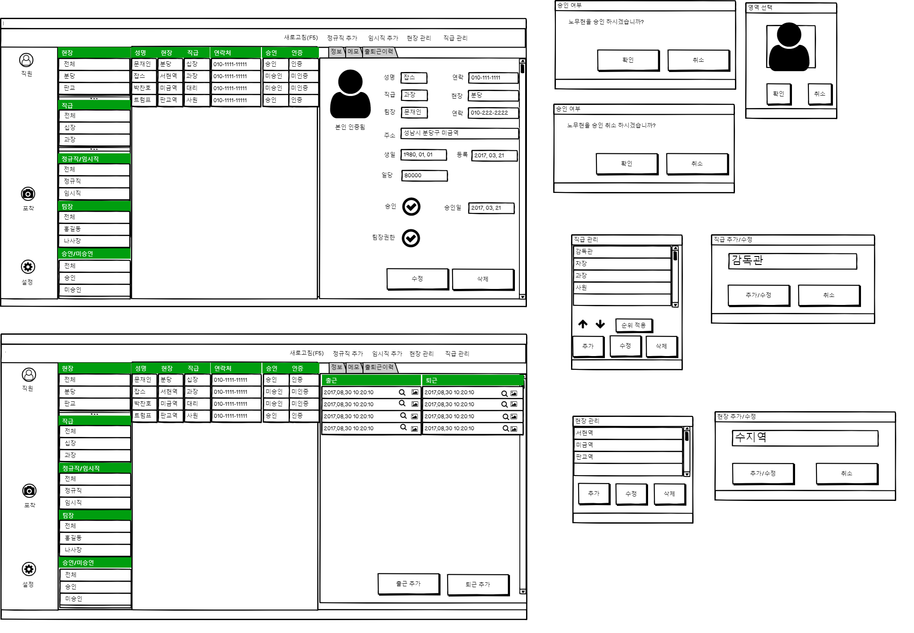
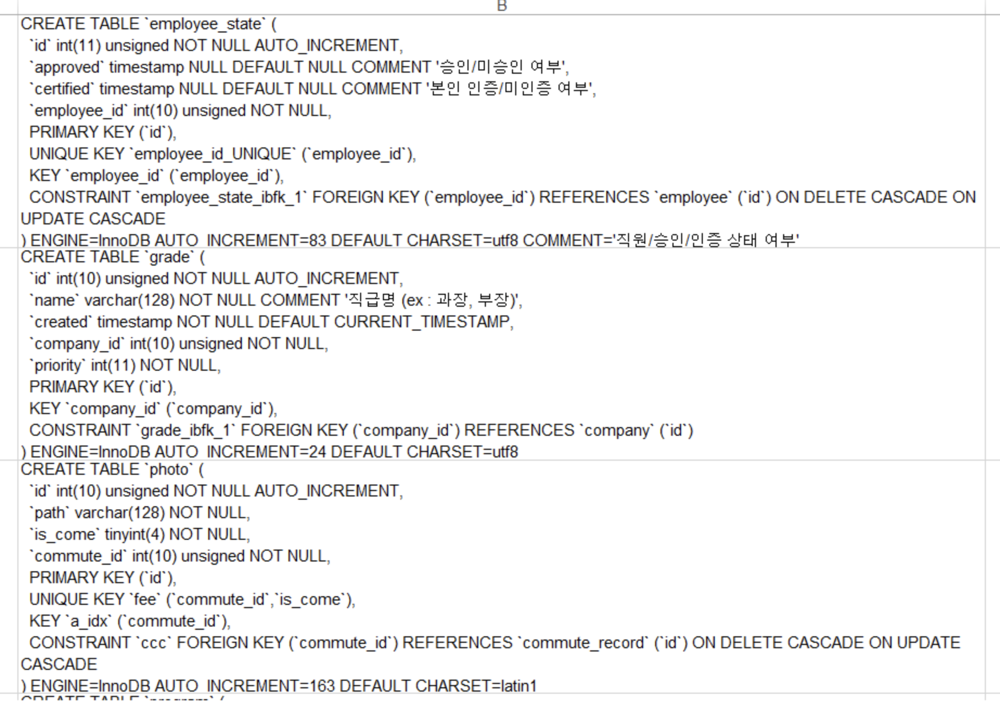
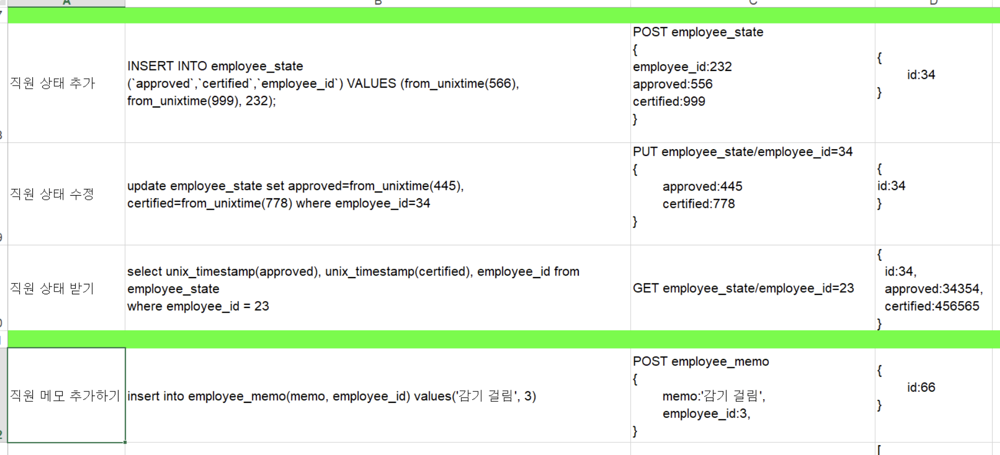

> 2021년 7월 13일 - 프로젝트 설계와 클린코드 팁

## 프로젝트 설계

### 화면 설계서

- 사용자 화면 및 관리자용 화면 등




### ERD (추상적 데이터 구조)

### Create Table (데이터 구조 구체화)

- ERD (추상적 데이터 구조) 👉 Create Table (데이터 구조 구체화)
- 예상하지 못한 부분이 증가하면 처음과 다르게 프로젝트가 진행되어 프로젝트 실패 확률이 높아짐
- 따라서 Key까지 구체화 할 것!



### DB Query

- 쿼리를 통해 받을 수 있는 REST API의 request와 response (json)

### REST API



### 설계를 잘 해야하는 이유

- 설계를 꼼꼼히 잘하면 실제 개발 (코딩) 단계에서 예상하지 못한 부분을 최소화 할 수 있음
  - 이를 통해서 개발 속도가 빨라짐
- 좋은 코드는 잘한 설계로 부터 나오는 것 => 설계를 잘하는 개발자가 잘하는 개발자
- 설계를 잘하는 정도는 없음, 스스로 시도하고 도전하고 시행착오를 겪으면서 길을 찾는 것

- 설계 리뷰가 코드 리뷰보다 중요

  - 최대한 돌발 변수가 생기지 않게, 꼼꼼히 설계하는 노력 필요
  - 설계를 잘 하는 개발자가 코드도 잘 짠다.

## 클린코드

- 진행이 의미가 없다면 즉시 함수 탈출하기

### 클린코드 예시

- 예시 설명

  - 파일을 출발지에서 목적지로 복사하는 코드

  - 파일 객체를 가져오고, 파일 존재 여부를 확인하고, 복사

- 개선되기 전 코드

  - `srcFile.exists()` 가 `true` 와 `false` 일 때 동작이 분기 됨
  - 코드를 해석할 때 `false` 일 때의 동작을 계속 상기해야 하므로 더 복잡

  ```java
  bool copyFile(string srcPath, string dstPath) {
      File srcFile = new File(srcPath);
      
      if (srcFile.exists() == true) {
          File dstFile = new File(dstPath);
          
          if (dstFile.exists() == true)
              return false;
          
          File.copy(srcPath, dstPath);
          
          return true;
      }
      
      return false;
  }
  ```

- 개선된 후 코드

  - `srcFile.Exists` 가 `false` 이면 바로 함수를 빠져 나감 (파일이 존재하지 않을 때 바로 return)
  - 따라서 그 아래는 모두 true 조건에 해당한다고 단순하게 생각할 수 있음

  ```java
  bool copyFile(string srcPath, string dstPath) {
      File srcFile = new File(srcPath);
      
      if (srcFile.exists() == false)
      	return false;
      
      File dstFile = new File(dstPath);
  
      if (dstFile.exists())
          return false;
      
      return File.Copy(srcPath, dstPath);
  }
  ```

- 개발자는 코드를 위에서 아래로 읽음

  - 소스 파일이 없을 경우에 대한 생각을 하고 소스 코드를 해석해야 함

- 조건이 성립되어야 동작하는 함수라면, 미성립 시 즉시 탈출하는 것이 가독성 높은 코드