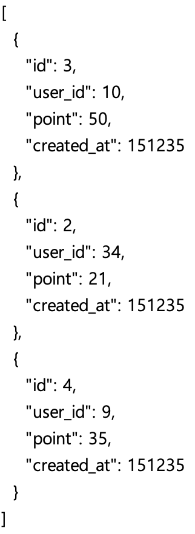
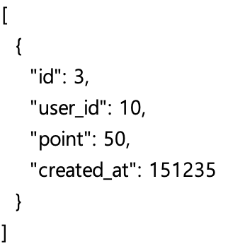
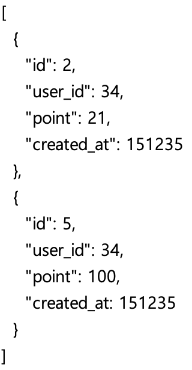
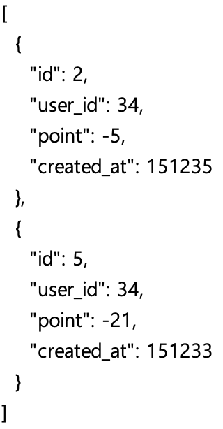
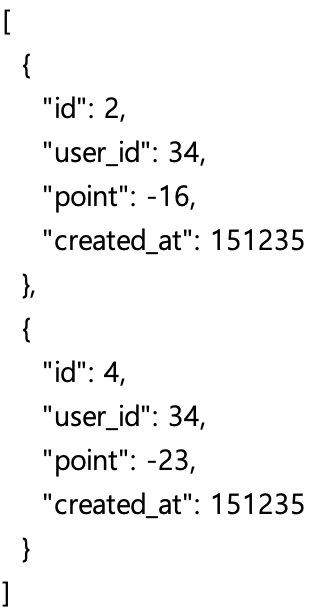
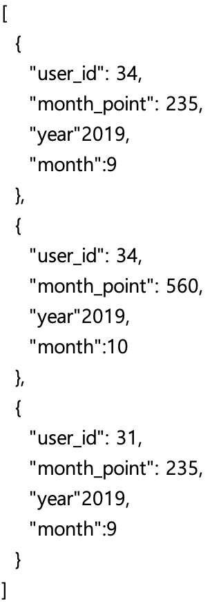
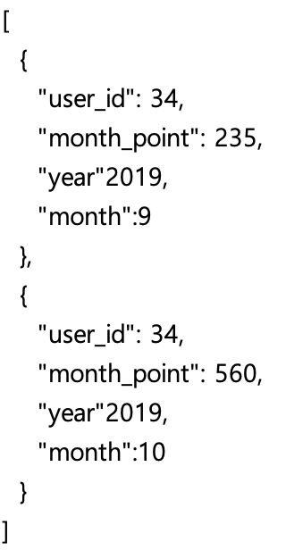
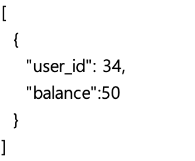

> 2021년 7월 23일 - REST API 및 Query 작성 예제

## REST API 및 Query 작성 예제

- 포인트 추가 및 내역 조회에 대한 예제 [📄](files/rest_api_point.xlsx)

- 저장된 Database

   

| Explanation                                | Method | Request                                                      | Response                                                     | Query                                                        |
| :----------------------------------------- | :----- | :----------------------------------------------------------- | :----------------------------------------------------------- | :----------------------------------------------------------- |
| 모든 point 기록 조회                       | Get    | api/point                                                    |  | `select * from point`                                        |
| 특정 point 기록 조회                       | Get    | api/point?id=3                                               |  | `select * from point where id=3`                             |
| 특정 사용자의 point 기록 조회              | Get    | api/point?user_id=34                                         |  | `select * from point where user_id=34`                       |
| 특정 사용자의 point 지출 기록 조회         | Get    | api/point?user_id=34&lt-point=0  api/point?user_id=34&point={'lt' :0} |  | `select * from point where user_id=34 and point < 0`         |
| 특정 사용자의 30 point 이내 지출 기록 조회 | Get    | api/point?user_id=34&lt-point=0&gt-point=-30  api/point?user_id=34&point={'lt' :0, 'gt':-30} |  | `select * from point where user_id=3 and point < 0 and point > -30` |
| 특정 사용자에게 point 추가                 | Post   | api/point { &nbsp;&nbsp;user_id:3, &nbsp;&nbsp;point:10 } |  | `insert into point(user_id, point) values(3, 10)`            |
| 월별 point 조회                            | Get    | api/point/monthly                                            |  | `select user_id, sum(point) as month_point, year(created_at), month(created_at) from point group by user_id, year(created_at), month(created_at)` |
| 특정 사용자의 월별 point 조회              | Get    | api/point/monthly?user_id=34                                 |  | `select user_id, sum(point) as month_point, year(created_at), month(created_at) from point group by user_id, year(created_at), month(created_at) where user_id=34` |
| 특정 사용자의 잔여 point 조회              | Get    | api/point/balance?user_id=34                                 |  | `select user_id, sum(point) as balance from point group by user_id where user_id=34` |

- 사용한 포인트를 음수로 표시하기 때문에 0보다 작다는 조건을 이용해서 지출 기록 조회 가능